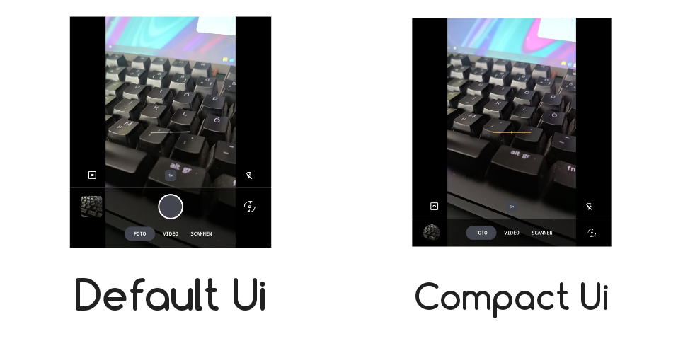

  

# LineageOS Camera: MindMod 📸

  
  

**MindMod** is a specialized fork of the open-source LineageOS Camera application, coded in Kotlin and optimized specifically for the **iKKO MindOne**. This mod bridges the gap between specialized hardware and Android software, ensuring that the flip camera, physical shutter button, and touch-sensitive focus controls work as native features.

---

## 🛠 Hardware Integration
MindMod communicates directly with the iKKO MindOne’s unique hardware components:
* **Shutter Button:** Full tactile support for photo and video capture.
* **Focus Touch Sensor:** Maps the capacitive touch state to trigger AF (Auto-Focus) pre-focusing.
* **Camera Hall-Effect Sensor:** Tracks the physical state of the flip camera for instant software orientation switching.
* **Camera Position Trigger:** Automatically adjusts UI and camera modes based on the physical position of the camera module.

## 🚀 Software Advancements

  

  

* **Maximized Viewfinder:** Dramatically increased preview area for an immersive shooting experience.
* **Compact UI:** Giving the user an even more increased preview area for an even more immersive shooting experience, only allowed through this unique Hardware.
* **Dynamic Flip Logic:** Physical camera movement instantly triggers the software camera switch.
* **Precision Zoom:** Re-engineered zoom curves for more precise transitions.
* **Live Aspect Ratio:** Viewfinder scaling now accurately reflects crop changes in real-time.
* **Camera Safer:** 4 min camera safer to avoid heat and preserve battery life.

---

## 📸 Features & Controls

### Main Controls
* **Shutter Button:**
  * **Press:** Configurable (Default: Shutter)
  * **Touch:** Configurable (Default: Focus)
* **Volume Buttons:**
  * **Press Up:** Configurable (Default: Zoom In)
  * **Press Down:** Configurable (Default: Zoom Out)
* **Viewfinder Gestures:**
  * **Single Tap:** Trigger Auto-Focus (AF) on a specific point.
  * **2-Finger Pinch:** Zoom In/Out.
* **Exposure Slider (Right Side):** Vertical slider for manual EV compensation.
* **Whitebalance Slider (Beside Exposure):** Slider for adjusting color temperature.
* **Zoom Slider (Bottom Center):** Horizontal slider for granular zoom control.
* **Focus Slider (Left Side):** Slider for manual focus adjustments.

### User Interface 
**Mode Selector Row:**
* Fotomode
* Videomode
* Scannermode

**Main Row:**
* **Gallery Thumbnail (Bottom Left):** Tap to open the device gallery.
* **Shutter Button (Bottom Center):** Capture photo or start/stop video.
* **Rotation Button (Bottom Right):** Manually rotates/flips the camera preview.

**Expanded Quick Action Row (Contextual):**
* **In Photo Mode:** 
  * Settings
  * Timer (Off/3s/10s)
  * Grid (Off/3x3/Golden Ratio)
  * Aspect Ratio (4:3/16:9/1.15:1)
* **In Video Mode:** 
  * Settings
  * Microphone Toggle
  * Timer (Off/3s/10s)
  * Grid (Off/3x3/Golden Ratio)
  * Aspect Ratio (4:3/16:9/1.15:1)
  * FPS (24/30/60)
  * Resolution (480p/720p/1080p)

---

## ⚙️ Settings Menu Reference

### Processing & Optics
* **Noise Reduction:** Algorithm-based grain removal, specifically optimized for dark conditions.
* **Sharpening:** Edge enhancement for increased detail definition.
* **Vignette Correction:** Adjusts light fall-off (shading) towards the edges of the lens.
* **Chromatic Aberration Correction:** Fixes color fringing caused by lens wavelength shifts.
* **Distortion Correction:** Compensates for optical lens warping.
* **Hotpixel Correction:** Interpolates and removes "stuck" or oversensitive sensor pixels.

### General Settings
* **Max Brightness:** Force screen to 100% when the app is active.
* **Save Location:** Store GPS coordinates in Metadata.
* **Shutter Sound:** Toggle the audible capture click.
* **Level:** Visual indicator for horizontal device alignment.
* **Compact Ui:** Removes Soft shutter and move Gallery thumbnail and Camera flip into the bottom row for more immersion.
* **Mirror Front Camera:** Toggle whether front-facing shots are saved as seen in preview.
* **Video Stabilization:** Enable software-based vibration reduction.
